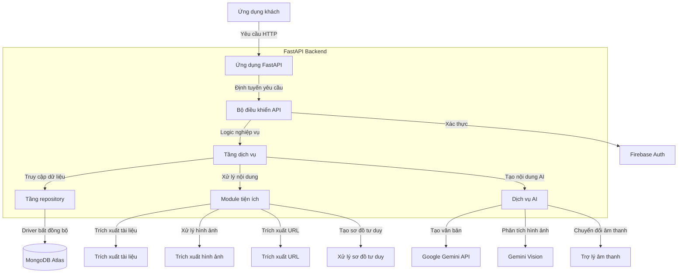
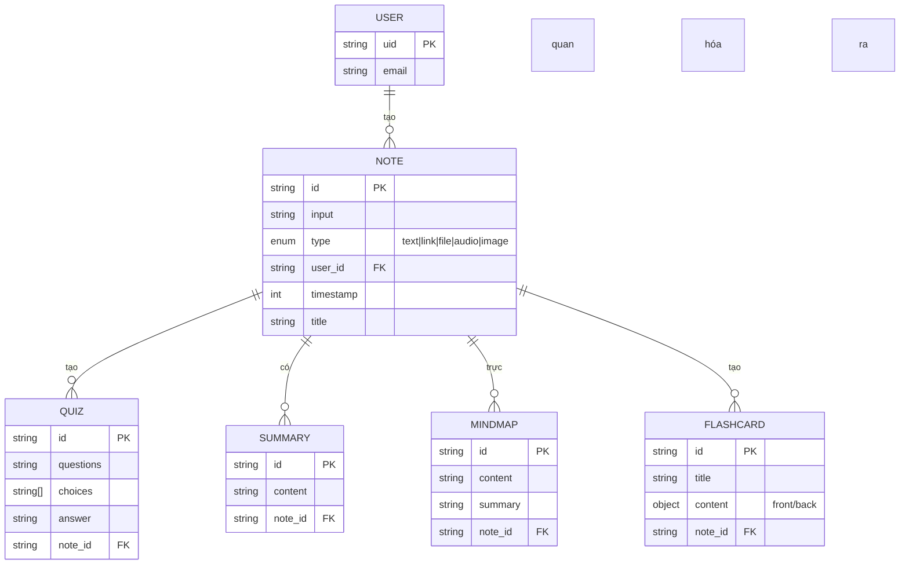
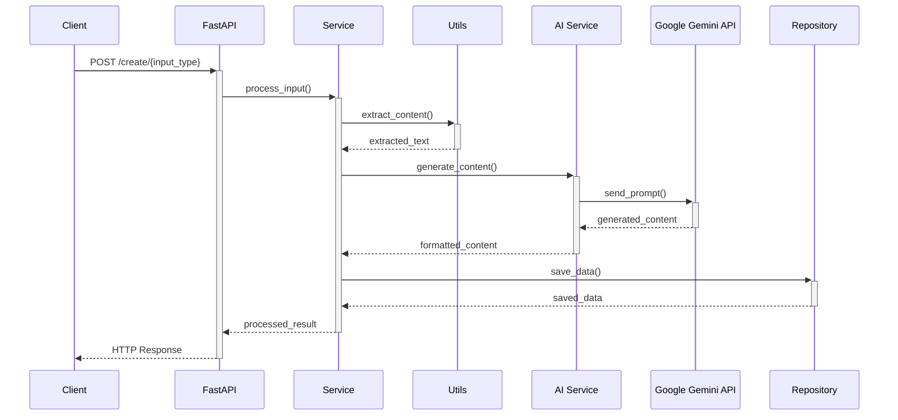

# 📚 P-Study Assistant Backend API

<div align="center">
  
  
  
  
  
</div>

<div align="center">
  <p><strong>Hệ thống backend trợ lý học tập thông minh được hỗ trợ bởi AI, chuyển đổi tài liệu học tập thành nội dung học tập tương tác</strong></p>
</div>

## 🌟 Tổng quan

P-Study Assistant Backend API là một hệ thống backend mạnh mẽ và có khả năng mở rộng được xây dựng bằng Python và FastAPI, được thiết kế để hỗ trợ một ứng dụng học tập toàn diện. Hệ thống cung cấp một bộ các điểm cuối RESTful phong phú để tạo, xử lý, lưu trữ và truy xuất các tài liệu học tập đa dạng. Hệ thống tận dụng AI (Google Gemini) để tự động tạo nội dung, bao gồm câu đố, thẻ ghi nhớ, sơ đồ tư duy và tóm tắt từ ghi chú do người dùng cung cấp. Tất cả dữ liệu được lưu trữ liên tục trong MongoDB, đảm bảo quản lý dữ liệu hiệu quả và linh hoạt.

## ✨ Tính năng

<div align="center">
  <table>
    <tr>
      <td align="center">📝</td>
      <td><strong>Xử lý nội dung</strong>: Tạo ghi chú từ nhiều nguồn (văn bản, liên kết, tệp, âm thanh, hình ảnh)</td>
    </tr>
    <tr>
      <td align="center">🤖</td>
      <td><strong>Tạo nội dung bằng AI</strong>: Tự động tạo nội dung giáo dục tiếng Việt từ ghi chú</td>
    </tr>
    <tr>
      <td align="center">🧠</td>
      <td><strong>Thẻ ghi nhớ</strong>: Tạo và quản lý thẻ ghi nhớ để ghi nhớ</td>
    </tr>
    <tr>
      <td align="center">❓</td>
      <td><strong>Câu đố</strong>: Tạo câu đố với các cấp độ khó tùy chỉnh</td>
    </tr>
    <tr>
      <td align="center">🗺️</td>
      <td><strong>Sơ đồ tư duy</strong>: Tạo tổ chức kiến thức trực quan</td>
    </tr>
    <tr>
      <td align="center">📊</td>
      <td><strong>Tóm tắt</strong>: Tạo tóm tắt ngắn gọn để xem lại nhanh</td>
    </tr>
    <tr>
      <td align="center">🔑</td>
      <td><strong>Xác thực</strong>: Xác thực người dùng qua Firebase</td>
    </tr>
    <tr>
      <td align="center">📊</td>
      <td><strong>Thống kê bảng điều khiển</strong>: Phân tích sử dụng toàn diện</td>
    </tr>
  </table>
</div>

## 📋 Mục lục

- [Công nghệ sử dụng](#-công-nghệ-sử-dụng)
- [Kiến trúc hệ thống](#-kiến-trúc-hệ-thống)
- [Mô hình dữ liệu](#-mô-hình-dữ-liệu)
- [Tài liệu API](#-tài-liệu-api)
- [Cài đặt](#-cài-đặt)
- [Cấu trúc dự án](#-cấu-trúc-dự-án)
- [Phát triển](#-phát-triển)

## 🔧 Công nghệ sử dụng

<div align="center">
  <table>
    <tr>
      <th>Danh mục</th>
      <th>Công nghệ</th>
    </tr>
    <tr>
      <td>Web Framework</td>
      <td>
        
        FastAPI (để xây dựng API mạnh mẽ và hiệu quả)
      </td>
    </tr>
    <tr>
      <td>ASGI Server</td>
      <td>
        
        Uvicorn (để phục vụ ứng dụng FastAPI)
      </td>
    </tr>
    <tr>
      <td>Cơ sở dữ liệu</td>
      <td>
        
        MongoDB Atlas (cơ sở dữ liệu NoSQL cho lưu trữ dữ liệu linh hoạt)
      </td>
    </tr>
    <tr>
      <td>Database Driver</td>
      <td>
        
        Motor (driver bất đồng bộ cho MongoDB)
      </td>
    </tr>
    <tr>
      <td>Xác thực dữ liệu</td>
      <td>
        
        Pydantic (để xác thực request/response và quản lý cài đặt)
      </td>
    </tr>
    <tr>
      <td>Xử lý nội dung</td>
      <td>
        PyPDF2, python-docx, Pillow, BeautifulSoup4 (để trích xuất tài liệu, hình ảnh và nội dung web)
      </td>
    </tr>
    <tr>
      <td>Dịch vụ AI</td>
      <td>
        
        Google Generative AI (Gemini API để tạo nội dung bằng AI)
      </td>
    </tr>
    <tr>
      <td>Xác thực</td>
      <td>
        
        Firebase Authentication
      </td>
    </tr>
    <tr>
      <td>Container hóa</td>
      <td>
        
        Docker và Docker Compose
      </td>
    </tr>
  </table>
</div>

## 🏗️ Kiến trúc hệ thống



### Thành phần chính

1. **Ứng dụng FastAPI (`app/server/app.py`)**:
   - Điểm vào cho tất cả các yêu cầu API
   - Quản lý định tuyến và xác thực request/response
   - Xử lý cấu hình CORS và middleware

2. **Tầng dịch vụ (`app/server/service.py`)**:
   - Chứa logic nghiệp vụ cốt lõi
   - Điều phối hoạt động giữa repository và dịch vụ AI
   - Quản lý quy trình xử lý và tạo nội dung

3. **Tầng Repository (`app/server/repository.py`)**:
   - Xử lý tất cả tương tác MongoDB thông qua Motor
   - Cung cấp lớp trừu tượng truy cập dữ liệu
   - Quản lý các hoạt động CRUD cho tất cả các thực thể

4. **Dịch vụ AI (`app/ai_services/`)**:
   - `assistant.py`: Quản lý tạo nội dung bằng AI (câu đố, thẻ ghi nhớ, sơ đồ tư duy, tóm tắt)
   - `audio_assistant.py`: Xử lý chuyển đổi âm thanh thành văn bản

5. **Module tiện ích (`app/utils/`)**:
   - `document_extractor.py`: Trích xuất văn bản từ nhiều định dạng tài liệu
   - `image_extractor.py`: Xử lý hình ảnh để trích xuất văn bản
   - `mindmap_processing.py`: Xử lý văn bản để tạo sơ đồ tư duy
   - `url_extractor.py`: Trích xuất nội dung từ URL web

6. **Mô hình dữ liệu (`app/server/models.py`)**:
   - Mô hình Pydantic để xác thực dữ liệu
   - Định nghĩa schema cho tất cả các thực thể API

## 📊 Mô hình dữ liệu

Ứng dụng sử dụng MongoDB làm cơ sở dữ liệu chính với các bộ sưu tập chính sau:



### Chi tiết bộ sưu tập

- **Notes**:
  - Bộ sưu tập trung tâm lưu trữ nội dung đã xử lý từ nhiều nguồn đầu vào
  - Trường: `id`, `input`, `type`, `user_id`, `timestamp`, `title`

- **Quizzes**:
  - Câu hỏi trắc nghiệm được tạo từ ghi chú
  - Trường: `id`, `questions`, `choices`, `answer`, `note_id`

- **Summaries**:
  - Tóm tắt ngắn gọn được tạo bởi AI từ ghi chú
  - Trường: `id`, `content`, `note_id`

- **Mind Maps**:
  - Dữ liệu có cấu trúc đại diện cho tổ chức kiến thức trực quan
  - Trường: `id`, `content`, `summary`, `note_id`

- **Flashcards**:
  - Bộ thẻ ghi nhớ để học thuộc
  - Trường: `id`, `title`, `content` (với văn bản mặt trước/sau), `note_id`

## 📘 Tài liệu API

API được tự động tạo tài liệu bằng Swagger UI. Sau khi khởi động máy chủ, truy cập vào `http://localhost:8000/docs` để xem tất cả các điểm cuối có sẵn với ví dụ.

### Tổng quan API

#### Xác thực
- `POST /auth/login` - Xác thực người dùng

#### Ghi chú
- `GET /note?user_id={user_id}` - Lấy tất cả ghi chú của người dùng
- `GET /note/{note_id}` - Lấy một ghi chú cụ thể

#### Câu đố
- `GET /quiz/{note_id}` - Lấy câu đố cho một ghi chú
- `POST /quiz/{note_id}` - Tạo câu đố từ một ghi chú
  - Tham số: `num_quizzes` (mặc định: 5), `difficulty` (1-4)

#### Tóm tắt
- `GET /summary/{note_id}` - Lấy tóm tắt cho một ghi chú

#### Sơ đồ tư duy
- `GET /mindmap/{note_id}` - Lấy sơ đồ tư duy cho một ghi chú
- `POST /mindmap/{note_id}` - Tạo sơ đồ tư duy từ một ghi chú

#### Thẻ ghi nhớ
- `GET /flashcard/{note_id}` - Lấy thẻ ghi nhớ cho một ghi chú
- `POST /flashcard/{note_id}` - Tạo thẻ ghi nhớ từ một ghi chú
  - Tham số: `num_flashcards` (mặc định: 5), `difficulty` (1-4)

#### Tạo nội dung
- `POST /create/text` - Tạo ghi chú từ đầu vào văn bản
  - Body: `{"text": "nội dung"}`
  - Query: `user_id`
- `POST /create/link` - Tạo ghi chú từ liên kết web
  - Body: `{"link": "https://example.com"}`
  - Query: `user_id`
- `POST /create/file` - Tạo ghi chú từ tệp tài liệu
  - Form: `file` (multipart/form-data)
  - Query: `user_id`
- `POST /create/audio` - Tạo ghi chú từ tệp âm thanh
  - Form: `file` (multipart/form-data)
  - Query: `user_id`
- `POST /create/image` - Tạo ghi chú từ hình ảnh
  - Form: `file` (multipart/form-data)
  - Query: `user_id`

#### Thống kê
- `GET /stats/dashboard` - Lấy thống kê bảng điều khiển

#### Người dùng
- `GET /users/firebase` - Lấy người dùng Firebase

## 🚀 Cài đặt

### Yêu cầu
- Python 3.11 trở lên
- Tài khoản MongoDB Atlas hoặc cài đặt MongoDB cục bộ
- Khóa API Google Gemini
- Thông tin xác thực Firebase Admin SDK

### Sử dụng Docker (Khuyến nghị)

1. **Clone repository**:
   ```bash
   git clone https://github.com/yourusername/p-study.git
   cd p-study/backend
   ```

2. **Tạo tệp `.env`** với cấu hình của bạn:
   ```env
   # Cấu hình MongoDB
   MONGODB_USERNAME=your_mongodb_username
   MONGODB_PASSWORD=your_mongodb_password
   MONGODB_CLUSTER=your_cluster.mongodb.net
   DB_NAME=study_app

   # Cấu hình AI
   GEMINI_API_KEY=your_gemini_api_key
   JINA_API_KEY=your_jina_api_key

   # Cấu hình Firebase (tùy chọn)
   FIREBASE_CREDENTIALS=path_to_firebase_credentials.json
   ```

3. **Chạy với Docker Compose**:
   ```bash
   docker-compose up -d
   ```

4. **Truy cập tài liệu API**:
   ```
   http://localhost:8000/docs
   ```

### Cài đặt thủ công

1. **Clone repository**:
   ```bash
   git clone https://github.com/yourusername/p-study.git
   cd p-study/backend
   ```

2. **Tạo môi trường ảo**:
   ```bash
   python -m venv venv
   source venv/bin/activate  # Trên Windows: venv\Scripts\activate
   ```

3. **Cài đặt các gói phụ thuộc**:
   ```bash
   pip install -r requirements.txt
   ```

4. **Tạo tệp `.env`** với cấu hình của bạn (như đã hiển thị ở trên)

5. **Chạy ứng dụng**:
   ```bash
   cd app
   python main.py
   ```

6. **Truy cập tài liệu API**:
   ```
   http://localhost:8000/docs
   ```

## 📁 Cấu trúc dự án

```
backend/
├── app/
│   ├── main.py                    # Điểm vào cho ứng dụng
│   ├── __init__.py
│   ├── server/
│   │   ├── app.py                 # Ứng dụng FastAPI và định tuyến
│   │   ├── models.py              # Mô hình Pydantic để xác thực dữ liệu
│   │   ├── repository.py          # Lớp truy cập cơ sở dữ liệu
│   │   ├── service.py             # Lớp logic nghiệp vụ
│   │   └── firebase-credentials/  # Thông tin xác thực Firebase admin SDK
│   ├── utils/
│   │   ├── document_extractor.py  # Trích xuất văn bản từ tài liệu
│   │   ├── image_extractor.py     # Trích xuất văn bản từ hình ảnh
│   │   ├── mindmap_processing.py  # Xử lý văn bản thành sơ đồ tư duy
│   │   └── url_extractor.py       # Trích xuất văn bản từ URL
│   └── ai_services/
│       ├── assistant.py           # Xử lý văn bản AI với Gemini
│       └── audio_assistant.py     # Chuyển đổi âm thanh thành văn bản
├── Dockerfile                     # Cấu hình Docker
├── docker-compose.yml             # Cấu hình Docker Compose
├── requirements.txt               # Các gói phụ thuộc của dự án
├── .gitignore                     # Tệp Git ignore
└── README.md                      # Tài liệu dự án
```

## 💻 Phát triển

### Thiết lập môi trường

1. **Cài đặt công cụ phát triển**:
   ```bash
   pip install flake8 pytest
   ```

2. **Kiểm tra phong cách code**:
   ```bash
   flake8 app
   ```

### Thêm tính năng mới

1. Thêm mô hình vào `models.py` nếu cần
2. Thêm thao tác cơ sở dữ liệu vào `repository.py`
3. Thêm logic nghiệp vụ vào `service.py`
4. Thêm điểm cuối API vào `app.py`

### Quy trình tích hợp AI



## 🔄 Luồng yêu cầu API

Dưới đây là luồng điển hình để tạo và sử dụng nội dung thông qua API:

```mermaid
graph TD
    A[Client] -->|1. POST /create/text| B[Tạo ghi chú]
    B -->|Lưu trong MongoDB| C[Ghi chú đã tạo]
    A -->|2. POST /quiz/{note_id}| D[Tạo câu đố]
    D -->|Xử lý AI| E[Câu đố đã tạo]
    A -->|3. POST /flashcard/{note_id}| F[Tạo thẻ ghi nhớ]
    F -->|Xử lý AI| G[Thẻ ghi nhớ đã tạo]
    A -->|4. POST /mindmap/{note_id}| H[Tạo sơ đồ tư duy]
    H -->|Xử lý AI| I[Sơ đồ tư duy đã tạo]
    A -->|5. GET /summary/{note_id}| J[Lấy tóm tắt]
    J -->|Truy xuất từ MongoDB| K[Trả về tóm tắt]
```

## 📈 Cải tiến trong tương lai

1. **Nâng cao xử lý AI**:
   - Cải thiện lời nhắc Gemini để tạo nội dung tốt hơn
   - Thêm hỗ trợ đa ngôn ngữ ngoài tiếng Việt

2. **Tích hợp với Frontend**:
   - Phát triển frontend React/Next.js cho ứng dụng hoàn chỉnh
   - Triển khai cập nhật thời gian thực với WebSockets

3. **Tính năng mở rộng**:
   - Triển khai thuật toán lặp lại theo khoảng thời gian cho thẻ ghi nhớ
   - Thêm khả năng ghi chú cộng tác
   - Phát triển phân tích cho tiến trình học tập

4. **Cải tiến cơ sở hạ tầng**:
   - Triển khai lớp bộ nhớ đệm với Redis
   - Thêm bộ kiểm tra toàn diện
   - Thiết lập pipeline CI/CD

## 👨‍💻 Thành viên nhóm

<div align="center">
  <table>
    <tr>
      <th>Mã sinh viên</th>
      <th>Họ và tên</th>
    </tr>
    <tr>
      <td>B21DCCN379</td>
      <td>Nguyễn Hữu Quang Hòa</td>
    </tr>
    <tr>
      <td>B21DCCN307</td>
      <td>Phạm Tuấn Giang</td>
    </tr>
    <tr>
      <td>B21DCCN092</td>
      <td>Phạm Thị Linh Mỹ</td>
    </tr>
    <tr>
      <td>B21DCCN427</td>
      <td>Bùi Thế Hướng</td>
    </tr>
  </table>
</div>

## 📄 Giấy phép

Dự án này được cấp phép theo Giấy phép MIT - xem tệp LICENSE để biết chi tiết.

## 👥 Người đóng góp

- Phát triển ban đầu bởi Nhóm P-Study

---

<div align="center">
  <p>
    <a href="https://github.com/yourusername/p-study">GitHub</a> •
    <a href="https://p-study-docs.example.com">Tài liệu</a> •
    <a href="mailto:contact@p-study.example.com">Liên hệ</a>
  </p>
</div>
