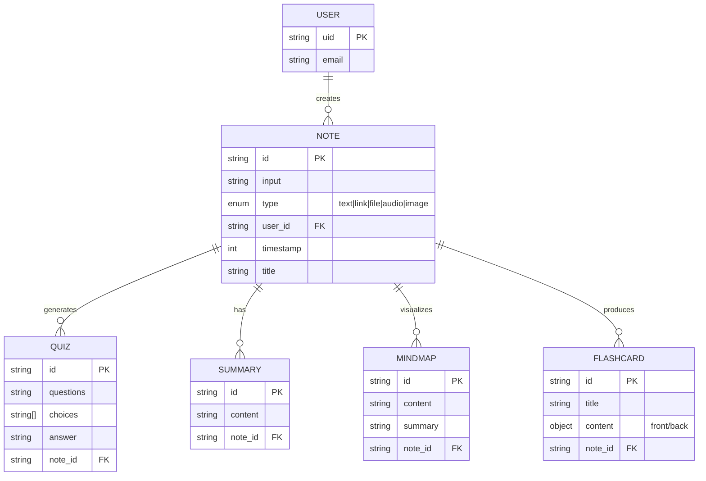
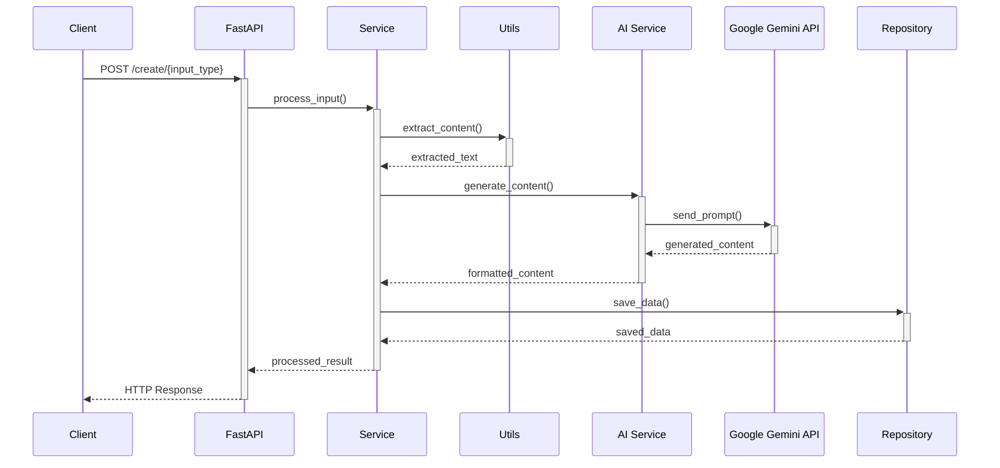

# 📚 P-Study Assistant Backend API

<div align="center">
  
  
  
  
  
</div>

<div align="center">
  <p><strong>A powerful AI-driven study assistant backend for transforming study materials into interactive learning content</strong></p>
</div>

## 🌟 Overview

The P-Study Assistant Backend API is a robust and scalable backend system built with Python and FastAPI, designed to power a comprehensive study application. It provides a rich set of RESTful endpoints for creating, processing, storing, and retrieving various study materials. The system leverages AI (Google Gemini) for automated content generation, including quizzes, flashcards, mind maps, and summaries, from user-provided notes. All data is persistently stored in MongoDB, ensuring efficient and flexible data management.

## ✨ Features

<div align="center">
  <table>
    <tr>
      <td align="center">📝</td>
      <td><strong>Content Processing</strong>: Create notes from multiple sources (text, links, files, audio, images)</td>
    </tr>
    <tr>
      <td align="center">🤖</td>
      <td><strong>AI-Powered Generation</strong>: Automatically generate Vietnamese educational content from notes</td>
    </tr>
    <tr>
      <td align="center">🧠</td>
      <td><strong>Flashcards</strong>: Create and manage flashcards for memorization</td>
    </tr>
    <tr>
      <td align="center">❓</td>
      <td><strong>Quizzes</strong>: Generate quizzes with customizable difficulty levels</td>
    </tr>
    <tr>
      <td align="center">🗺️</td>
      <td><strong>Mind Maps</strong>: Generate visual organization of knowledge</td>
    </tr>
    <tr>
      <td align="center">📊</td>
      <td><strong>Summaries</strong>: Create concise summaries for quick review</td>
    </tr>
    <tr>
      <td align="center">🔑</td>
      <td><strong>Authentication</strong>: User authentication via Firebase</td>
    </tr>
    <tr>
      <td align="center">📊</td>
      <td><strong>Dashboard Statistics</strong>: Comprehensive usage analytics</td>
    </tr>
  </table>
</div>

## 📋 Table of Contents

- [Technology Stack](#-technology-stack)
- [System Architecture](#-system-architecture)
- [Data Model](#-data-model)
- [API Documentation](#-api-documentation)
- [Installation](#-installation)
- [Project Structure](#-project-structure)
- [Development](#-development)

## 🔧 Technology Stack

<div align="center">
  <table>
    <tr>
      <th>Category</th>
      <th>Technology</th>
    </tr>
    <tr>
      <td>Web Framework</td>
      <td>
        
        FastAPI (for building robust and efficient APIs)
      </td>
    </tr>
    <tr>
      <td>ASGI Server</td>
      <td>
        
        Uvicorn (for serving the FastAPI application)
      </td>
    </tr>
    <tr>
      <td>Database</td>
      <td>
        
        MongoDB Atlas (NoSQL database for flexible data storage)
      </td>
    </tr>
    <tr>
      <td>Database Driver</td>
      <td>
        
        Motor (asynchronous driver for MongoDB)
      </td>
    </tr>
    <tr>
      <td>Data Validation</td>
      <td>
        
        Pydantic (for request/response validation and settings management)
      </td>
    </tr>
    <tr>
      <td>Content Processing</td>
      <td>
        PyPDF2, python-docx, Pillow, BeautifulSoup4 (for document, image, and web content extraction)
      </td>
    </tr>
    <tr>
      <td>AI Services</td>
      <td>
        
        Google Generative AI (Gemini API for AI-powered content generation)
      </td>
    </tr>
    <tr>
      <td>Authentication</td>
      <td>
        
        Firebase Authentication
      </td>
    </tr>
    <tr>
      <td>Containerization</td>
      <td>
        
        Docker and Docker Compose
      </td>
    </tr>
  </table>
</div>

## 🏗️ System Architecture


### Key Components

1. **FastAPI Application (`app/server/app.py`)**:
   - Entry point for all API requests
   - Manages routing and request/response validation
   - Handles CORS and middleware configuration

2. **Service Layer (`app/server/service.py`)**:
   - Contains the core business logic
   - Orchestrates operations between repositories and AI services
   - Manages content processing and generation workflows

3. **Repository Layer (`app/server/repository.py`)**:
   - Handles all MongoDB interactions via Motor
   - Provides data access abstraction
   - Manages CRUD operations for all entities

4. **AI Services (`app/ai_services/`)**:
   - `assistant.py`: Manages AI-powered content generation (quizzes, flashcards, mind maps, summaries)
   - `audio_assistant.py`: Handles audio transcription

5. **Utility Modules (`app/utils/`)**:
   - `document_extractor.py`: Extracts text from various document formats
   - `image_extractor.py`: Processes images to extract text
   - `mindmap_processing.py`: Processes text for mind map generation
   - `url_extractor.py`: Extracts content from web URLs

6. **Data Models (`app/server/models.py`)**:
   - Pydantic models for request/response validation
   - Schema definitions for all API entities

## 📊 Data Model

The application uses MongoDB as its primary database with the following key collections:



### Collection Details

- **Notes**:
  - Central collection storing processed content from various inputs
  - Fields: `id`, `input`, `type`, `user_id`, `timestamp`, `title`

- **Quizzes**:
  - Multiple-choice questions generated from notes
  - Fields: `id`, `questions`, `choices`, `answer`, `note_id`

- **Summaries**:
  - AI-generated concise summaries of notes
  - Fields: `id`, `content`, `note_id`

- **Mind Maps**:
  - Structured data representing visual knowledge organization
  - Fields: `id`, `content`, `summary`, `note_id`

- **Flashcards**:
  - Sets of flashcards for memorization
  - Fields: `id`, `title`, `content` (with front/back text), `note_id`

## 📘 API Documentation

The API is self-documented using Swagger UI. After starting the server, navigate to `http://localhost:8000/docs` to see all available endpoints with examples.

### API Overview

#### Authentication
- `POST /auth/login` - Authenticate user

#### Notes
- `GET /note?user_id={user_id}` - Get all notes for a user
- `GET /note/{note_id}` - Get a specific note

#### Quizzes
- `GET /quiz/{note_id}` - Get quizzes for a note
- `POST /quiz/{note_id}` - Create quizzes from a note
  - Parameters: `num_quizzes` (default: 5), `difficulty` (1-4)

#### Summaries
- `GET /summary/{note_id}` - Get the summary for a note

#### Mind Maps
- `GET /mindmap/{note_id}` - Get the mind map for a note
- `POST /mindmap/{note_id}` - Create a mind map from a note

#### Flashcards
- `GET /flashcard/{note_id}` - Get flashcards for a note
- `POST /flashcard/{note_id}` - Create flashcards from a note
  - Parameters: `num_flashcards` (default: 5), `difficulty` (1-4)

#### Content Creation
- `POST /create/text` - Create a note from text input
  - Body: `{"text": "content"}`
  - Query: `user_id`
- `POST /create/link` - Create a note from a web link
  - Body: `{"link": "https://example.com"}`
  - Query: `user_id`
- `POST /create/file` - Create a note from a document file
  - Form: `file` (multipart/form-data)
  - Query: `user_id`
- `POST /create/audio` - Create a note from an audio file
  - Form: `file` (multipart/form-data)
  - Query: `user_id`
- `POST /create/image` - Create a note from an image
  - Form: `file` (multipart/form-data)
  - Query: `user_id`

#### Statistics
- `GET /stats/dashboard` - Get dashboard statistics

#### Users
- `GET /users/firebase` - Get Firebase users

## 🚀 Installation

### Prerequisites
- Python 3.11 or later
- MongoDB Atlas account or local MongoDB installation
- Google Gemini API key
- Firebase Admin SDK credentials

### Using Docker (Recommended)

1. **Clone the repository**:
   ```bash
   git clone https://github.com/yourusername/p-study.git
   cd p-study/backend
   ```

2. **Create a `.env` file** with your configuration:
   ```env
   # MongoDB Configuration
   MONGODB_USERNAME=your_mongodb_username
   MONGODB_PASSWORD=your_mongodb_password
   MONGODB_CLUSTER=your_cluster.mongodb.net
   DB_NAME=study_app

   # AI Configuration
   GEMINI_API_KEY=your_gemini_api_key
   JINA_API_KEY=your_jina_api_key

   # Firebase Configuration (optional)
   FIREBASE_CREDENTIALS=path_to_firebase_credentials.json
   ```

3. **Run with Docker Compose**:
   ```bash
   docker-compose up -d
   ```

4. **Access the API documentation**:
   ```
   http://localhost:8000/docs
   ```

### Manual Setup

1. **Clone the repository**:
   ```bash
   git clone https://github.com/yourusername/p-study.git
   cd p-study/backend
   ```

2. **Create a virtual environment**:
   ```bash
   python -m venv venv
   source venv/bin/activate  # On Windows: venv\Scripts\activate
   ```

3. **Install dependencies**:
   ```bash
   pip install -r requirements.txt
   ```

4. **Create a `.env` file** with your configuration (as shown above)

5. **Run the application**:
   ```bash
   cd app
   python main.py
   ```

6. **Access the API documentation**:
   ```
   http://localhost:8000/docs
   ```

## 📁 Project Structure

```
backend/
├── app/
│   ├── main.py                    # Entry point for the application
│   ├── __init__.py
│   ├── server/
│   │   ├── app.py                 # FastAPI application and routes
│   │   ├── models.py              # Pydantic models for data validation
│   │   ├── repository.py          # Database access layer
│   │   ├── service.py             # Business logic layer
│   │   └── firebase-credentials/  # Firebase admin SDK credentials
│   ├── utils/
│   │   ├── document_extractor.py  # Extract text from documents
│   │   ├── image_extractor.py     # Extract text from images
│   │   ├── mindmap_processing.py  # Process text into mindmaps
│   │   └── url_extractor.py       # Extract text from URLs
│   └── ai_services/
│       ├── assistant.py           # AI text processing with Gemini
│       └── audio_assistant.py     # Audio transcription
├── Dockerfile                     # Docker configuration
├── docker-compose.yml             # Docker Compose configuration
├── requirements.txt               # Project dependencies
├── .gitignore                     # Git ignore file
└── README.md                      # Project documentation
```

## 💻 Development

### Environment Setup

1. **Install development tools**:
   ```bash
   pip install flake8 pytest
   ```

2. **Code style check**:
   ```bash
   flake8 app
   ```

### Adding New Features

1. Add models to `models.py` if needed
2. Add database operations to `repository.py`
3. Add business logic to `service.py`
4. Add API endpoints to `app.py`

### AI Integration Flow



## 🔄 API Request Flow

Below is the typical flow for creating and consuming content through the API:

```mermaid
graph TD
    A[Client] -->|1. POST /create/text| B[Create Note]
    B -->|Store in MongoDB| C[Note Created]
    A -->|2. POST /quiz/{note_id}| D[Generate Quiz]
    D -->|AI Processing| E[Quizzes Created]
    A -->|3. POST /flashcard/{note_id}| F[Generate Flashcards]
    F -->|AI Processing| G[Flashcards Created]
    A -->|4. POST /mindmap/{note_id}| H[Generate Mind Map]
    H -->|AI Processing| I[Mind Map Created]
    A -->|5. GET /summary/{note_id}| J[Get Summary]
    J -->|Retrieve from MongoDB| K[Return Summary]
```

## 📈 Future Enhancements

1. **Enhanced AI Processing**:
   - Improve Gemini prompts for better content generation
   - Add multi-language support beyond Vietnamese

2. **Integration with Frontend**:
   - Develop React/Next.js frontend for a complete application
   - Implement real-time updates with WebSockets

3. **Extended Features**:
   - Implement spaced repetition algorithms for flashcards
   - Add collaborative note-taking capabilities
   - Develop analytics for learning progress

4. **Infrastructure Improvements**:
   - Implement caching layer with Redis
   - Add comprehensive testing suite
   - Set up CI/CD pipeline

## 📄 License

This project is licensed under the MIT License - see the LICENSE file for details.

## 👥 Contributors

- Initial development by P-Study Team

---

<div align="center">
  <p>
    <a href="https://github.com/yourusername/p-study">GitHub</a> •
    <a href="https://p-study-docs.example.com">Documentation</a> •
    <a href="mailto:contact@p-study.example.com">Contact</a>
  </p>
</div>
